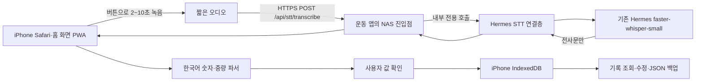

# 음성 운동 기록 MVP 재설계: NAS Hermes `small` STT

> **폐기됨(2026-10-01).** iPhone 키보드 받아쓰기로 전환한 뒤 STT 컨테이너와 관련 코드(`pwa/speech.mjs`, `backend/stt_*.mjs`, `Dockerfile.stt`, `setup-stt-secrets.sh`)를 삭제했다. 이 문서는 설계 기록으로만 남긴다.

작성일: 2026-09-26  
상태: 로컬 구현·자동 테스트 완료. NAS 배포와 iPhone 실기기 검증은 남아 있다.

## 결정과 근거

개인용 iPhone PWA와 기존 공개 HTTPS 주소를 유지한다. 세트가 끝나면 사용자가 마이크 버튼을 눌러 짧은 음성을 녹음한다. NAS에서 운영 중인 Hermes의 한국어 `faster-whisper-small`로 전사하고, iPhone 앱이 전사문에서 중량·횟수를 해석한다. 운동 기록은 기존처럼 iPhone의 IndexedDB에 저장한다. 운동일지를 Hermes 대화나 Telegram으로 보내지 않는다.

현재 `pwa/speech.mjs`는 Safari `SpeechRecognition`을 호출한다. iPhone에서 첫 입력은 성공했지만 반복 입력 중 `aborted`가 재현됐다. 따라서 앱의 음성 입력은 `getUserMedia` + `MediaRecorder`로 교체한다. 이 변경은 브라우저 음성인식 서비스 호출을 없애지만, 실제 녹음·업로드는 iPhone 실기기 검증이 필요하다. [WebKit의 MediaRecorder 설명](https://webkit.org/blog/11353/mediarecorder-api/)에 따라 녹음 형식은 기기에서 `MediaRecorder.isTypeSupported()`로 확인한다.

새 Hermes 설치 프로젝트의 [설치·검증 기록](../../nas-hermes-agent/INSTALLATION_PLAN.md)은 2026-09-24 기준 `stt.language=ko`, `stt.local.model=small`, Telegram 한국어 음성 전사 성공을 기록한다. 같은 12.2초 음성 1개에서 `small` 반복 전사 약 10.7초, `medium` 약 30.9초였고 두 모델의 문자 오류율은 1.9%로 같았다. 이는 **운동 숫자 발화의 정확도나 짧은 발화 지연을 검증한 결과가 아니다.** 사용자는 이후 운영 모델을 `small`로 바꿨다고 확인했다. [Hermes Voice Mode 문서](https://hermes-agent.nousresearch.com/docs/user-guide/features/voice-mode)는 로컬 STT와 `small` 모델을 지원한다고 설명한다.

## 구성

기존 Tailscale Funnel `:8443`은 정적 PWA의 진입점으로 유지하고 같은 출처의 `/api/stt/*`만 NAS 내부 STT 연결층으로 역방향 프록시한다. 따라서 iPhone의 기존 사이트 저장소와 기록 주소를 유지하고 CORS 설정도 단순해진다. 공개된 화면과 달리 음성 API는 192-bit 일회용 등록 코드로 첫 iPhone 한 대만 등록하고, 30일 HttpOnly/Secure/SameSite 쿠키로 제한한다. 코드는 NAS 터미널에서만 확인하며 채팅이나 브라우저 저장소 백업에 넣지 않는다. API에는 요청 빈도·동시성·오디오 크기 제한을 둔다.

Hermes 대시보드 `:9119`와 기존 Telegram 게이트웨이는 공개 프록시 경로에 넣지 않는다. 운동 앱은 전사문만 받는다. ChatGPT OAuth, LLM 응답, TTS, Telegram 메시지 전송은 이 요청에 사용하지 않는다. STT는 NAS 로컬에서 실행되므로 건당 외부 STT API 요금은 없다. NAS CPU·메모리와 Funnel 전송량은 사용한다.

### Hermes 연동 경로

설치된 Hermes 배포 기록과 해당 버전 소스를 대조한 결과, 연동은 Hermes 대시보드의 내장 `POST /api/audio/transcribe`를 사용한다. 별도 `voice-fitness-stt` 연결층은 서버 내부에서 Hermes 로그인 세션을 확보·캐시하고, 전사 호출에서 세션 만료가 확인되면 한 번만 다시 인증한다. 브라우저에 자격 증명이나 Hermes 쿠키를 전달하지 않는다.

NAS 배포 시 실제 Hermes 인증 계정과 `POST /api/audio/transcribe`의 동작, Telegram 처리 영향 및 small 모델 자원 사용을 확인한다. 컨테이너 네트워크에서만 `hermes:9119`을 연결층에 노출하며 Funnel 경로에는 Hermes 대시보드를 추가하지 않는다.

`/api/audio/transcribe` 자체는 Hermes 대시보드 API이므로 Funnel에서 직접 접근할 수 있게 열지 않는다. 공개 PWA와 같은 출처의 `/api/stt/`만 추가해, 이 경로에서 전사 호출에 필요한 인증을 서버 쪽에서 처리한다. 브라우저에 Hermes 세션 토큰이나 대시보드 비밀번호를 보내지 않는다. NAS에서 인증 전달 방식과 요청 크기 제한을 확인하기 전에는 프록시 설정을 고정하지 않는다.

이 경로를 현재 컨테이너에서 사용할 수 없거나, 별도 모델 적재가 서비스에 무리가 되는 것으로 확인되면 Hermes의 transcribe 함수를 호출하는 제한된 전사 확장을 다음 대안으로 검토한다. 일반 Hermes API 서버 `:8642`는 agent 도구 실행 권한을 제공하는 별도 기능이므로 음성 앱을 위해 켜지 않는다. 새 gateway나 중복 Hermes 컨테이너도 만들지 않는다.

## 앱 동작과 API 계약 초안

1. 운동 종목·현재 중량을 선택하고 세트를 마친다.
2. 마이크를 눌러 녹음을 시작하고 `8개` 또는 `75킬로 9회`라고 말한 뒤 `입력 끝내기`를 누른다. 최대 길이 10초, 크기 상한은 녹음 형식과 실측 결과를 보고 설정한다. 일정 시간 후 자동 종료를 보조 수단으로 둔다.
3. 녹음이 끝나면 iPhone의 마이크 트랙을 즉시 닫고 한 번만 업로드한다. 업로드·전사 중에는 별도 상태를 표시한다. 화면 이탈·중단 시 결과를 기록으로 만들지 않는다.
4. NAS는 허용된 오디오 형식·크기·길이를 확인하고 임시 파일로 전사한다. `language=ko`, 운영 중인 `small` 설정을 사용한다. 성공 응답은 `requestId`, `text`, `elapsedMs`만 포함한다. 임시 음성은 정상·오류 경로 모두에서 삭제한다.
5. iPhone이 `pwa/parser.mjs`의 확정적 규칙으로 전사문을 해석한다. 현재 종목·중량은 녹음 시작 시점의 값으로 고정한다. `8개`는 현재 중량 8회, `75킬로 9회`는 75kg 9회다. 무음·모호한 숫자·`다음은 75로`는 자동 기록하지 않는다.
6. 처음 운영하는 동안에는 화면에서 **전사문과 해석된 값(예: `벤치프레스 · 70kg × 8회`)을 확인한 뒤 저장**한다. 확인 전에는 IndexedDB에 세트를 추가하지 않는다. 수집한 실제 오인식률이 충분히 낮을 때에만 확실한 발화의 자동 저장을 후속 옵션으로 검토한다.
7. 저장 성공 후에만 `저장됨`을 표시한다. 기존 `inputId` 중복 방지, 수정·취소·JSON 백업 흐름을 유지한다. 전사 실패, 인증 실패, 시간 초과, 연결 끊김은 직접 입력으로 이어진다.

구현 API는 JSON base64 오디오를 받는 `POST /api/stt/transcribe`이며, 성공 응답은 `requestId`, `text`, `elapsedMs`다. `/api/stt/session`은 등록 상태를 조회하고, `/api/stt/enroll`은 일회용 코드를 받아 세션 쿠키를 설정한다. 오류는 안전한 `code`와 선택적 사용자 메시지만 응답한다. 오디오 상한 2 MiB, 분당 15회, 동시 전사 2건으로 제한하며 자동 재전송하지 않는다.

## 접근, 보존, 운영

- 접근: 공개 화면과 음성 API 접근을 분리한다. 일회용 48자 16진수 코드는 NAS의 `secrets/stt.json`에 저장하며, 한 번 성공하면 `state/registration.json`으로 재등록을 막는다. 기기 쿠키 만료·기기 변경 시에는 관리자가 `state/registration.json`을 지우고 코드를 재발급하는 운영 절차가 필요하다.
- 요청 제한: 인증과 별도로 파일 크기·녹음 길이·동시 처리 수·분당 요청 수를 제한한다. Hermes가 Telegram 음성을 처리 중이면 앱에는 대기 또는 `잠시 후 다시 시도`를 표시한다.
- 저장: 운동일지는 iPhone IndexedDB만 사용한다. 서버에는 기본적으로 원본 음성과 전사문을 보관하지 않고, 요청 ID·성공 여부·총 소요 시간·오류 코드 등 최소 진단 정보만 짧게 유지한다.
- 기존 Hermes의 활성 `voice-archive` 플러그인은 모든 전사 오디오를 `/opt/data/workspace/voice-log`에 저장하므로, 운동 앱 음성 사용 전에 해당 플러그인을 비활성화한다. 이는 archive 테스트 플러그인만 끄며 Telegram STT와 기존 Hermes Gateway는 유지한다. 기존 보관 파일은 삭제하지 않는다. 비활성화 전까지는 오디오 미보관을 보장할 수 없다. `voice-transcript-log`는 별도 활성 상태를 점검해 새 웹 전사에 사용자 발화 텍스트가 남지 않는지 확인한다.
- iPhone 오프라인에서는 기존 기록 조회·직접 입력을 제공하고 음성은 업로드하지 않는다. NAS 장애 시에도 수동 기록을 사용할 수 있어야 한다.
- Service Worker는 화면 자산만 캐시하고 `/api/stt/*` 응답과 음성 업로드를 캐시하지 않는다. 새 버전 배포 시 모듈 캐시 갱신과 현재 IndexedDB 기록 보존을 함께 검증한다.

## 단계별 구현·확인

| 단계 | 작업 | 통과 기준 |
| --- | --- | --- |
| 1. NAS 연동 조사 | 완료: 내부 전사 API·대시보드 인증·등록 접근 설계 및 활성 archive 플러그인 확인 | NAS 현재 상태는 배포 직전 사용자 명령 결과로 재확인 |
| 2. 녹음 화면·연결층 | 완료: MediaRecorder, 취소·마이크 해제, 프록시, Hermes 세션 어댑터 구현 | 자동화된 모듈 테스트 통과; iPhone 실기기 20회 검증 대기 |
| 3. 보호·배포 패키지 | 완료: 일회용 등록, rate/concurrency/body 제한, NAS Compose·비밀 생성기 구현 | 로컬 테스트 통과; NAS 배포·접근 제어 E2E 대기 |
| 4. 앱 통합 | 완료: 전사 결과 파싱 후 확인을 거쳐 기존 IndexedDB에 저장 | 로컬 테스트 통과; iPhone 숫자 발화·오인식 검증 대기 |
| 5. 현장 확인 | 대기 | 헬스장 소음, 실제 지연·정확도·NAS 부하를 측정 |

첫 지연 목표는 미리 숫자로 단정하지 않는다. 기존 12.2초 음성 벤치마크는 짧은 `8개` 발화를 대표하지 않는다. 녹음 종료부터 전사문 표시까지의 지연, `8/18`·`50/15`·`70/75kg` 혼동, 실패 비율, 모델 첫 호출과 반복 호출, Hermes/Telegram 응답 영향을 각각 측정한 뒤 기준을 확정한다. 빠른 응답이 필요하더라도 정확성을 입증하기 전 자동 저장을 켜지 않는다.

## 기존 파일과 변경 범위

| 유지·교체 | 파일 또는 역할 |
| --- | --- |
| 유지 | `pwa/domain.mjs`, `pwa/db.mjs`의 로컬 운동 기록과 중복 방지 |
| 보강 | `pwa/parser.mjs`의 운동 숫자 표현과 모호성 처리 |
| 교체 | `pwa/speech.mjs`의 브라우저 `SpeechRecognition`을 짧은 녹음 모듈로 변경 |
| 보강 | `pwa/app.mjs`에 녹음·전송·전사·확인·저장 상태와 오류 진단 추가 |
| 보강 | PWA Nginx에 `/api/stt/` 프록시와 요청 크기 제한 추가 |
| 신규 | NAS 내부 전사 연결층, Compose·Nginx 설정, 일회용 등록·비밀 초기화 스크립트 |
| 유지 | 기존 `hermes`의 Telegram·OAuth·대시보드·모델 설정 및 `voice-fitness-pwa`의 IndexedDB 출처 |

`backend/`의 오래된 FastAPI 실험은 영어 중심 파서와 서버 측 SQLite 운동일지를 포함하므로 이 설계의 저장 서버로 재사용하지 않는다. 운동 기록은 iPhone에 남기고 신규 서버는 전사만 담당한다.
