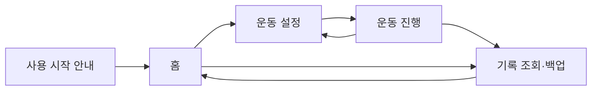

# 개인용 PWA 사용자 화면 설계

기준: 현재 화면은 [기존 MVP 설계](mvp-design.md)를 따른다. 다음 음성 화면은 [Hermes STT 재설계안](hermes-stt-design.md)의 `녹음 → 전송·전사 → 값 확인 → 저장` 흐름으로 바꾼다. 브라우저 시안은 [screen-prototype.html](screen-prototype.html)이다. 새 흐름은 아직 구현·iPhone 검증 전이다.

## 화면 원칙

처음 기록하는 사용자가 종목과 중량을 정하고 바로 첫 세트를 남길 수 있게 한다. 운동 중에는 현재 설정, 지난 기록, 오늘 세트, 마이크 버튼을 한눈에 보여준다. **온라인 음성**은 편한 입력 방법이며, 연결이 없거나 인식에 실패하면 같은 위치에서 **직접 입력**으로 이어진다. 저장 결과와 저장 전 후보를 명확히 구분한다.

색과 배치는 기존 시안의 운동 파랑 `#007AFF`, 밝은 표면 `#F2F2F7`, 흰 카드, 짙은 글자, 성공 녹색을 유지한다. 어두운 모드도 지원한다. iPhone에서 손가락으로 누르는 영역은 44×44pt 이상으로 설계한다.

## 화면 지도

| 화면 | 먼저 보여줄 정보 | 주 행동 | 보조 행동 |
| --- | --- | --- | --- |
| 사용 시작 | Safari 홈 화면 추가 방법, 음성에는 인터넷 필요, 마이크 권한 | 마이크 시험 또는 운동 시작 | 권한·연결 안내 |
| 홈 | 오늘 운동 시작 또는 재개, 최근 기록 | 운동 시작·이어하기 | 기록 보기 |
| 운동 설정 | 종목·중량·목표 횟수·중량 기준 | 이 종목으로 시작 | 종목 검색·직접 입력 |
| 운동 진행 | 현재 운동·설정, 이전 기록, 오늘 세트 | 눌러서 말하기 | 직접 입력·수정·취소·운동 종료 |
| 기록 | 날짜별 운동과 세트 | 상세 확인 | 수정·JSON 내보내기·복원 |

홈 화면에 추가하지 않아도 Safari에서 사용할 수 있다. 사용 시작 안내는 처음 또는 권한 문제가 있을 때만 보인다. 브라우저에서 앱을 다시 열면 저장된 진행 상태를 복원한다.

## 운동 진행의 상태와 문구

| 상태 | 화면 문구 | 행동 |
| --- | --- | --- |
| 준비 | “세트가 끝났다면 말해주세요” | 마이크 버튼 누르기 |
| 듣는 중 | “듣는 중… ‘8개’처럼 말해주세요” | 발화·입력 끝내기·취소 |
| 전송·처리 중 | “음성을 확인하고 있어요” | 중복 입력 막기 |
| 확인 필요 | “8회 또는 18회로 들었어요” | 값 선택·다시 말하기·직접 입력 |
| 저장 완료 | “2세트 · 70kg × 8회 저장됨” | 다음 세트·수정·방금 기록 취소 |
| 연결 없음 | “인터넷 연결이 없어 음성 입력을 사용할 수 없어요” | 직접 입력; 연결 후 다시 말하기 |
| 마이크 거부 | “마이크 접근을 허용하면 음성 기록을 쓸 수 있어요” | Safari 권한 안내·직접 입력 |
| 인식·서버 오류 | “음성을 처리하지 못했어요. 기록은 추가되지 않았습니다” | 다시 말하기·직접 입력 |
| 저장 실패 | “기록을 저장하지 못했어요” | 값을 유지하고 저장 재시도 |

연결이 없으면 마이크를 비활성화하고 직접 입력을 먼저 보여준다. 연결이 있는 것처럼 표시되더라도 서버 오류가 나면 입력을 저장하지 않고 오류 상태로 바꾼다. 명확한 결과는 확인 팝업 없이 저장하되 바로 수정·취소할 수 있어야 한다. “다음은 75로”처럼 세트 발화가 아닌 말은 저장하지 않는다.

## 기록 보존 화면

기록은 날짜 → 종목 → 세트로 확인한다. 같은 이름이라도 장비·중량 기준이 다른 운동은 비교할 때 구분한다. 기록 화면에 **“기록 파일 내보내기”**, **“기록 파일 복원”**, **“마지막 백업: 날짜 또는 없음”**을 둔다. 복원 시 파일 검증 후 가져올 운동일지와 중복 처리 결과를 보여준다. 브라우저 데이터가 지워지면 파일 백업 없이 복원할 수 없다는 안내를 간결하게 제공한다.

## 목업과 실기기 확인

목업은 화면 전환·상태 표현 시안이다. 마이크, 온라인 STT, IndexedDB, 파일 백업은 연결되어 있지 않다. 실제 iPhone Safari와 홈 화면 PWA에서 권한 요청, 소음 환경의 인식, 연결 끊김, 한 손 수정, 글자 확대, 기록 내보내기·복원, 어두운 환경의 대비를 확인해야 한다.
